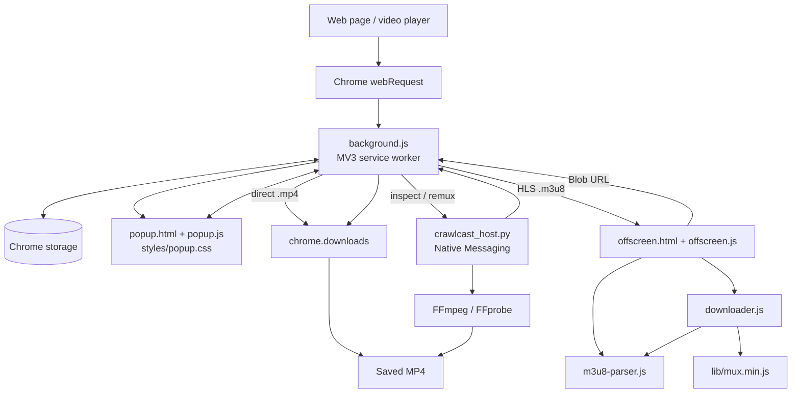
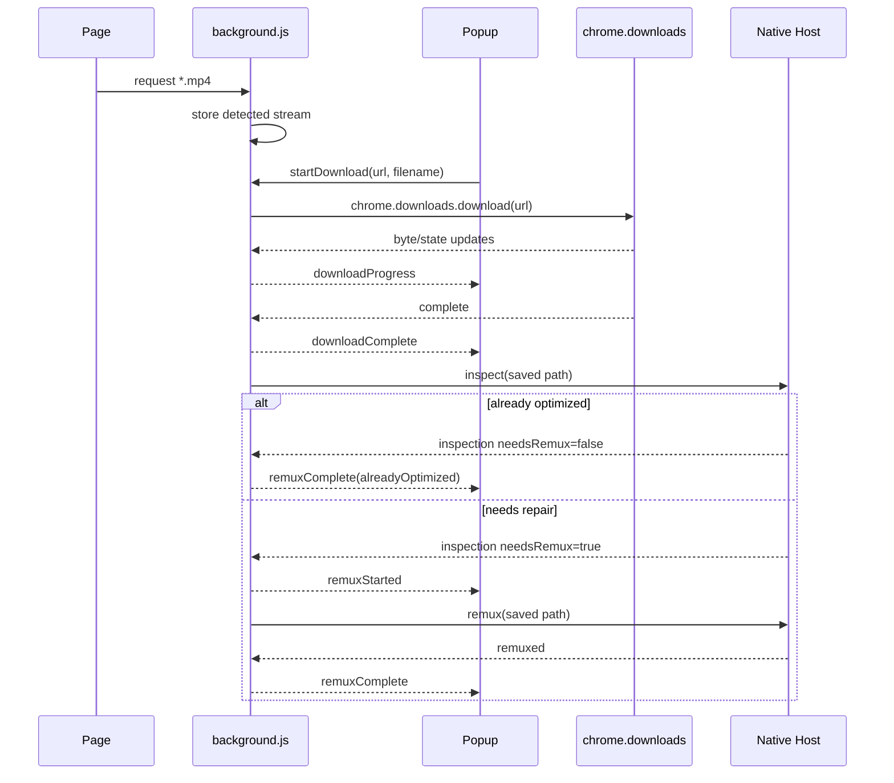

# Crawlcast — Project Architecture & Developer Reference

> **Repository snapshot:** uploaded `check.zip`  
> **Git branch:** `main`  
> **Git commit:** `10fcfa3da78eb46890c74a27d62b338c745440c2` (`10fcfa3`)  
> **Worktree at inspection time:** clean  
> **Chrome manifest schema:** Manifest V3 (`"manifest_version": 3`)  
> **Extension package version:** `0.1.0` (`"version": "0.1.0"`)  
> **Document regenerated:** 2026-09-18  
> **Purpose:** authoritative technical reference for this exact Crawlcast repository snapshot.

Crawlcast is a Chrome Manifest V3 browser extension that detects downloadable video requests made by the active page and handles two media paths:

1. **Direct MP4** — detected `.mp4` URLs are handed directly to Chrome's download manager.
2. **HLS / M3U8** — detected `.m3u8` playlists are parsed, downloaded segment-by-segment, converted/assembled into MP4 in an offscreen document, then saved through Chrome.

An optional native messaging host can inspect and repair downloaded MP4 files with FFmpeg/FFprobe. It is especially important for HLS output because the browser pipeline produces fragmented MP4.

This file is intentionally developer-focused. `README.md` is the customer/developer-facing overview; `PROJECT.md` explains how the implementation actually works.

---

## Table of contents

1. [Current product state](#1-current-product-state)
2. [Architecture at a glance](#2-architecture-at-a-glance)
3. [Runtime contexts](#3-runtime-contexts)
4. [Repository map](#4-repository-map)
5. [Manifest and permissions](#5-manifest-and-permissions)
6. [Media detection](#6-media-detection)
7. [State and persistence](#7-state-and-persistence)
8. [Popup UI](#8-popup-ui)
9. [User Mode, God Mode, and Premium scaffolding](#9-user-mode-god-mode-and-premium-scaffolding)
10. [Direct MP4 pipeline](#10-direct-mp4-pipeline)
11. [HLS / M3U8 pipeline](#11-hls--m3u8-pipeline)
12. [Playlist parsing](#12-playlist-parsing)
13. [HLS segment downloading and retry behavior](#13-hls-segment-downloading-and-retry-behavior)
14. [Transmuxing and MP4 assembly](#14-transmuxing-and-mp4-assembly)
15. [Separate HLS audio](#15-separate-hls-audio)
16. [Thumbnails and metadata](#16-thumbnails-and-metadata)
17. [Native MP4 inspection and repair](#17-native-mp4-inspection-and-repair)
18. [Cross-context message protocol](#18-cross-context-message-protocol)
19. [Diagnostics and logging](#19-diagnostics-and-logging)
20. [Cancellation and cleanup](#20-cancellation-and-cleanup)
21. [Known limits and implementation gaps](#21-known-limits-and-implementation-gaps)
22. [Unused / stale repository artifacts](#22-unused--stale-repository-artifacts)
23. [Development workflow](#23-development-workflow)
24. [Testing matrix](#24-testing-matrix)
25. [Store / production readiness](#25-store--production-readiness)
26. [Change-safety notes](#26-change-safety-notes)

---

# 1. Current product state

The current branch implements the following behavior.

### Detection

- Detects URLs containing `.m3u8` before the URL end, query string, or fragment.
- Detects URLs containing `.mp4` before the URL end, query string, or fragment.
- Associates a detected request with the originating Chrome tab.
- Shows a per-tab badge count.
- Keeps up to 50 detected stream entries in session storage.

### Popup

- Dark Crawlcast UI with separated `styles/popup.css`.
- One card per detected stream.
- `M3U8` / `MP4` badges.
- Page-title-derived filenames.
- Clickable title and pencil icon for editing the saved filename title.
- HLS thumbnails with hover animation when preview generation succeeds.
- Duration, estimated size, resolution, host, request type, and segment count when available.
- Download progress and cancellation.
- Final `Complete!` state after native inspection/repair succeeds.
- Floating diagnostic log window.
- Clear button for removing detected streams that are not actively healthy downloads.
- No main Refresh button.

### Free / Premium scaffolding

- **User Mode is the default.**
- User Mode allows one accepted download start per rolling 60-minute window.
- A live purple countdown is shown inside the Premium panel after the free limit is hit.
- **God Mode** bypasses the rate limit and currently exists for development/testing.
- Premium billing/account entitlement is not implemented yet.
- The Premium CTA currently reports that Premium is coming soon.

### Downloads

- Direct MP4 uses `chrome.downloads` directly.
- HLS downloads run through the offscreen document.
- HLS automatically selects the highest-bandwidth variant.
- HLS segment fetch concurrency is currently `2`.
- Temporary `429/500/502/503/504` failures retry with exponential backoff, jitter, `Retry-After` support, and a shared cooldown.
- A segment that exhausts retries fails the whole HLS download instead of being silently skipped.
- In-browser HLS assembly is guarded at approximately **1.5 GB estimated media size**.

### MP4 finalization

- HLS output is sent through the native repair path when the host is available.
- Direct MP4 files are inspected first.
- Already-normal direct MP4 files skip FFmpeg entirely.
- Fragmented or non-faststart MP4 files are remuxed with `-c copy -movflags +faststart`.
- Separate HLS audio can be merged during the same native FFmpeg pass.

---

# 2. Architecture at a glance



The central architectural rule is:

> **`background.js` owns browser-level coordination; `offscreen.js` owns DOM/media work; `crawlcast_host.py` owns local filesystem/FFmpeg work.**

The popup is a view/controller. It is not authoritative state because it is destroyed whenever the popup closes.

---

# 3. Runtime contexts

Crawlcast spans four runtime environments.

## 3.1 MV3 service worker — `background.js`

The service worker is the central broker.

It owns or coordinates:

- media request detection;
- detected stream registry;
- browser toolbar badge state;
- User Mode rate limiting;
- direct MP4 downloads;
- HLS download startup;
- download progress bookkeeping;
- Chrome Downloads API operations;
- Blob URL lifecycle coordination;
- thumbnail job coordination;
- diagnostics log storage;
- native messaging connection;
- MP4 inspection/remux state;
- separate-audio merge handoff.

The worker has no normal page DOM. It therefore cannot perform the HLS preview and Blob-oriented media work directly.

## 3.2 Popup — `popup.html`, `popup.js`, `styles/popup.css`

The popup is recreated every time the browser action UI opens.

It is responsible for:

- querying the active tab;
- requesting current streams from the service worker;
- rendering stream cards;
- collecting title edits;
- constructing safe output filenames;
- displaying User/God mode;
- displaying the User Mode cooldown;
- starting/cancelling downloads;
- showing download progress;
- showing repair/finalization status;
- showing floating logs;
- presenting the Premium stub.

It does **not** own durable download state.

## 3.3 Offscreen document — `offscreen.html`, `offscreen.js`

The offscreen document exists because MV3 service workers do not provide the DOM/media APIs needed by this pipeline.

It hosts:

- `mux.js`;
- `M3U8Parser`;
- `VideoDownloader`;
- `Blob` creation;
- `URL.createObjectURL()`;
- `<video>` decoding;
- `<canvas>` thumbnail capture;
- HLS segment downloading/transmux orchestration.

It is created on demand and closed when no HLS download, pending Blob, or thumbnail job needs it.

## 3.4 Native host — `native-host/crawlcast_host.py`

The native host is a local process outside Chrome.

It communicates with Chrome using the Native Messaging length-prefixed JSON protocol over stdin/stdout.

It currently supports two actions:

- `inspect` — quickly classify MP4 container structure without reading the full media payload;
- `remux` — run FFmpeg stream-copy repair and optionally merge a separate audio file.

The host is optional for basic download saving, but important for final HLS compatibility and separate-audio merging.

---

# 4. Repository map

```text
crawlcast-extension/
├── manifest.json
├── background.js
├── popup.html
├── popup.js
├── styles/
│   └── popup.css
├── offscreen.html
├── offscreen.js
├── downloader.js
├── m3u8-parser.js
├── auth.js
├── lib/
│   ├── mux.min.js
│   └── StreamSaver.min.js
├── icons/
│   ├── icon16.png
│   ├── icon48.png
│   ├── icon128.png
│   └── download_icon.png
├── native-host/
│   ├── crawlcast_host.py
│   ├── crawlcast_host.bat
│   ├── com.crawlcast.downloader.json
│   ├── register-native-host.ps1
│   ├── register-native-host.sh
│   ├── register-native-host-from-wsl.sh
│   └── README.md
├── tools/
│   ├── remux.sh
│   └── Repair-Videos.ps1
├── README.md
└── PROJECT.md
```

## File responsibilities

| File | Current responsibility |
|---|---|
| `manifest.json` | MV3 metadata, permissions, service-worker entry point, popup, icons. |
| `background.js` | Main coordinator: detection, storage, User Mode limit, direct MP4, HLS orchestration, browser downloads, logs, native host. |
| `popup.html` | Popup markup only. Styling lives outside the HTML. |
| `styles/popup.css` | All popup presentation/layout styling. |
| `popup.js` | Popup rendering, editable titles, filename generation, mode UI, countdown, progress, logs, controls. |
| `offscreen.html` | Hidden extension document that loads mux.js, parser, downloader, and offscreen glue. |
| `offscreen.js` | HLS job orchestration, thumbnail/metadata work, Blob URL creation, progress/error relay. |
| `downloader.js` | `VideoDownloader`: HLS fetching, retries, variant handling, TS/fMP4 processing, audio rendition download, Blob preparation. |
| `m3u8-parser.js` | HLS master/media parser, URL resolution, variant/audio selection. |
| `lib/mux.min.js` | Runtime dependency used to transmux MPEG-TS into fragmented MP4. |
| `native-host/crawlcast_host.py` | MP4 inspection, FFmpeg stream-copy repair, optional audio merge, duration verification. |
| `native-host/crawlcast_host.bat` | Windows launcher for the Python native host. |
| `native-host/com.crawlcast.downloader.json` | Chrome Native Messaging host manifest. |
| `native-host/register-native-host.ps1` | Updates allowed extension ID and registers host in Windows registry. |
| `native-host/register-native-host-from-wsl.sh` | WSL helper that invokes the PowerShell registration script. |
| `tools/remux.sh` | Standalone batch/remux helper, outside the extension runtime. |
| `tools/Repair-Videos.ps1` | Standalone PowerShell video repair/scan helper, outside the extension runtime. |
| `auth.js` | Legacy/stub auth code. Not loaded or referenced by the current extension runtime. |
| `lib/StreamSaver.min.js` | Checked-in legacy library. Not loaded or referenced by the current runtime. |

---

# 5. Manifest and permissions

Current `manifest.json`:

```json
{
  "manifest_version": 3,
  "name": "Crawlcast",
  "version": "0.1.0",
  "description": "Detect and download HLS streams and direct MP4 video from the web",
  "permissions": [
    "webRequest",
    "storage",
    "activeTab",
    "downloads",
    "offscreen",
    "nativeMessaging"
  ],
  "host_permissions": [
    "http://*/*",
    "https://*/*"
  ],
  "background": {
    "service_worker": "background.js"
  },
  "action": {
    "default_popup": "popup.html",
    "default_icon": {
      "16": "icons/icon16.png",
      "48": "icons/icon48.png",
      "128": "icons/icon128.png"
    }
  },
  "icons": {
    "16": "icons/icon16.png",
    "48": "icons/icon48.png",
    "128": "icons/icon128.png"
  }
}
```

## Permission purpose

| Permission | Why Crawlcast currently needs it |
|---|---|
| `webRequest` | Observe outgoing browser requests and detect `.m3u8` / `.mp4`. |
| `storage` | Persist stream/session data, logs, direct-download restoration state, and local mode/cooldown state. |
| `activeTab` | Read active-tab information such as title and scope popup results to the current tab. |
| `downloads` | Save direct MP4 files and HLS-generated Blob URLs; monitor download completion/cancellation. |
| `offscreen` | Run DOM-capable HLS/media work unavailable to a service worker. |
| `nativeMessaging` | Talk to the local MP4 inspection/repair host. |
| `http://*/*`, `https://*/*` | Detect media and fetch playlists/segments from arbitrary web origins over normal web protocols. |

### Current manifest note

This snapshot already uses a customer-facing description and limits host permissions to normal HTTP/HTTPS origins:

- `"description": "Detect and download HLS streams and direct MP4 video from the web."`
- `"host_permissions": ["http://*/*", "https://*/*"]`

The `webRequest` listener itself still uses `{ urls: ["<all_urls>"] }` as its filter, but Chrome's manifest host permissions bound which web origins the extension can actually observe.

---

# 6. Media detection

Detection is entirely in `background.js`.

```js
const M3U8_PATTERN = /\.m3u8(?:$|[?#])/i;
const MP4_PATTERN = /\.mp4(?:$|[?#])/i;
```

A `chrome.webRequest.onBeforeRequest` listener receives requests matching `<all_urls>` and calls `getStreamFormat(url)`.

A detected entry has the current shape:

```js
{
  url,
  timestamp,
  tabId,
  type,
  initiator,
  format,   // "m3u8" | "mp4"
  title     // null until user edits it; popup otherwise uses page title
}
```

The map is keyed by URL:

```js
const detectedStreams = new Map();
```

### Important behavior

- Duplicate URLs are ignored globally with `detectedStreams.has(url)`.
- The registry is capped at 50 entries.
- The oldest map entry is evicted after the cap is exceeded.
- The current tab's count is shown on the extension badge.
- Stream state is mirrored to `chrome.storage.session`.

### Consequence of URL-keyed storage

If the exact same media URL appears in two different tabs, only the first stored entry exists because URL is the map key. This can prevent the same URL from appearing independently under the second tab.

---

# 7. State and persistence

Crawlcast intentionally mixes in-memory state with Chrome storage.

## 7.1 `chrome.storage.session`

Session storage survives service-worker suspension/restart but is cleared when the browser session ends.

### `detectedStreams`

Serialized form of:

```js
Array.from(detectedStreams.entries())
```

Used to restore detected cards after a service-worker restart.

### `directDownloads`

Serialized direct-download tracking:

```js
Array.from(directDownloads.entries())
```

This lets a direct MP4 browser download survive a service-worker restart and rehydrate `activeDownloads` from `chrome.downloads.search()`.

### `logs`

Up to 400 centralized diagnostic log entries.

## 7.2 `chrome.storage.local`

Persists across browser restarts.

### `crawlcastMode`

Current value:

```text
user | god
```

Invalid/missing values fall back to `user`.

### `userModeLastDownloadAt`

Timestamp of the last accepted User Mode download start.

The next allowed start is:

```text
userModeLastDownloadAt + 60 minutes
```

## 7.3 Important in-memory-only maps/sets

These are **not** fully persisted:

- `activeDownloads`
- `pendingBlobUrls`
- `pendingAudioMerge`
- `thumbnailJobs`
- popup `activeDownloadsUI`
- popup `completedDownloadsUI`
- popup `thumbFrames`

Direct MP4 downloads have explicit restoration logic; HLS active-download bookkeeping does not have equivalent full persistence.

---

# 8. Popup UI

The popup is split cleanly into three files:

```text
popup.html
popup.js
styles/popup.css
```

There is no intentionally embedded popup CSS inside the HTML or JavaScript.

## 8.1 Header

Contains:

- Crawlcast brand/icon;
- User/God mode toggle;
- detected-stream count.

## 8.2 Premium panel

Contains:

- Premium heading;
- Premium description;
- free-limit countdown region;
- `Get Premium` button;
- dismiss/close control;
- coming-soon status.

The Premium button is currently a stub and does not perform billing.

## 8.3 Stream card

A card can contain:

- thumbnail or placeholder;
- duration badge;
- `M3U8` / `MP4` format badge;
- request-type badge;
- editable title;
- host;
- detection age;
- size/duration/resolution/segment metadata;
- raw media URL;
- Cancel button when active;
- Download / Downloading… / Complete! button;
- progress bar;
- status message.

## 8.4 Editable titles

The title can be edited by:

- clicking the title; or
- clicking the pencil control.

Behavior:

- `Enter` commits through blur;
- blur saves;
- `Esc` cancels;
- `setStreamTitle` persists the title on the detected stream;
- titles are locked while a card is downloading or complete.

The filename is generated from the current card title and sanitized for filesystem safety.

### Filename sanitation

`buildDownloadFilename()`:

- removes an existing common video extension;
- replaces Windows-invalid characters and control characters;
- collapses whitespace;
- removes trailing dots/spaces;
- protects Windows reserved names (`CON`, `PRN`, etc.);
- truncates the basename to 180 characters;
- falls back to `video_<timestamp>.mp4`.

## 8.5 Bottom toolbar

Current bottom toolbar actions:

- **Logs**
- **Clear**

The old main Refresh button has been intentionally removed.

---

# 9. User Mode, God Mode, and Premium scaffolding

Rate limiting is enforced in `background.js`, not merely in the popup.

That matters because closing/reopening the popup must not bypass the free-tier limit.

```js
const USER_MODE_DOWNLOAD_LIMIT_MS = 60 * 60 * 1000;
let crawlcastMode = 'user';
```

## User Mode

- Default mode.
- One accepted download start per rolling hour.
- The slot is consumed when `background.js` accepts the start request.
- If the pipeline cannot even start, the slot is returned.
- Later network/download failures still count as the consumed attempt.

## God Mode

- Bypasses the time limit.
- Exists as a development/testing tool.
- Intended to be removed from the public production UI before store release.

## Countdown

`popup.js` receives `nextAllowedAt` from the background worker and runs a one-second UI timer.

When limited:

- idle download buttons are disabled;
- the Premium panel displays the purple countdown;
- the mode-toggle tooltip reports remaining time.

At expiry:

- countdown hides;
- idle download buttons re-enable automatically;
- no popup refresh is required.

## Premium

The current Premium UI is only product scaffolding.

Not implemented yet:

- payment provider integration;
- customer accounts;
- subscription creation;
- entitlement lookup;
- Premium feature unlocks;
- restore purchase/sign-in flow.

---

# 10. Direct MP4 pipeline

Direct `.mp4` requests do **not** go through the HLS downloader.



## 10.1 Start

`startDownload()` dispatches by format:

```js
if (format === 'mp4') {
  return startDirectMp4Download(url, filename || 'video.mp4');
}
```

## 10.2 Browser-managed download

`startDirectMp4Download()` calls:

```js
chrome.downloads.download({ url, filename })
```

This avoids the HLS in-memory Blob limit.

## 10.3 Progress

`chrome.downloads.onChanged` updates:

- `bytesReceived`;
- `totalBytes`;
- calculated percent;
- popup status.

If total size is not known, popup progress becomes indeterminate and shows bytes received.

## 10.4 Service-worker restart handling

Direct download mappings are persisted in `chrome.storage.session`.

On restore, Crawlcast:

1. reloads download ID → stream mapping;
2. calls `chrome.downloads.search()`;
3. reconstructs active direct-download state;
4. immediately finishes or drops interrupted entries when appropriate.

## 10.5 Completion

On browser completion:

1. popup receives `downloadComplete`;
2. UI changes to **Checking MP4 file…**;
3. native host inspects the file when available;
4. already-optimized files skip FFmpeg;
5. unhealthy container layout runs stream-copy remux;
6. popup reaches **Complete** / **Complete!** after `remuxComplete`.

---

# 11. HLS / M3U8 pipeline

HLS is substantially more complex than direct MP4.

```mermaid
sequenceDiagram
    participant Popup
    participant BG as background.js
    participant OFF as offscreen.js
    participant P as M3U8Parser
    participant D as VideoDownloader
    participant M as mux.js
    participant CD as chrome.downloads
    participant NH as Native Host

    Popup->>BG: startDownload(.m3u8)
    BG->>OFF: downloadStream
    OFF->>D: download(url, filename)
    D->>P: parse master/media playlist
    D->>D: select highest bandwidth variant
    D->>D: estimate size / enforce 1.5 GB guard
    loop media segments
        D->>D: fetch with retry/backoff
        alt MPEG-TS
            D->>M: transmux TS → fMP4
        else fMP4/CMAF
            D->>D: prepend EXT-X-MAP init segment when needed
        end
        D-->>OFF: progress callback
        OFF-->>BG: downloadProgress
        BG-->>Popup: downloadProgress
    end
    D->>D: patch init-segment durations
    D-->>OFF: Blob + optional audio Blob
    OFF-->>BG: saveBlob
    BG->>CD: save video/audio
    CD-->>BG: complete
    BG->>NH: remux / merge + faststart
    NH-->>BG: remuxed
    BG-->>Popup: remuxComplete
```

## HLS stages

1. Fetch playlist.
2. Parse playlist.
3. If master: choose highest-bandwidth video variant.
4. Detect referenced separate audio rendition.
5. Fetch selected media playlist.
6. Estimate size.
7. Abort before heavy work when estimate exceeds memory guard.
8. Initialize mux.js transmuxer.
9. Fetch segments with a two-request sliding window.
10. Consume/transmux strictly in playlist order.
11. Patch duration fields into initial MP4 metadata.
12. Assemble in-memory `Blob`.
13. Download separate audio rendition if required.
14. Create Blob URL(s) in offscreen document.
15. Ask background worker to save via `chrome.downloads`.
16. Run native repair/merge when available.

---

# 12. Playlist parsing

`m3u8-parser.js` exposes `M3U8Parser`.

## Parsed structures

A parsed playlist currently contains:

```js
{
  isMaster,
  variants,
  media,
  segments,
  initSegmentUrl,
  metadata: {
    targetDuration,
    mediaSequence,
    version
  }
}
```

## Supported tags / concepts

### `#EXT-X-STREAM-INF`

Creates quality variants with:

- bandwidth;
- resolution;
- codecs;
- frame rate;
- linked audio group.

### `#EXT-X-MEDIA`

Captures alternate media entries including:

- type;
- group ID;
- name;
- language;
- default/autoselect/forced flags;
- channel count;
- URI.

Current runtime selection logic uses this for **audio renditions**.

### `#EXT-X-MAP`

Captures a playlist-level init segment for fMP4/CMAF media.

Current implementation stores the most recent `initSegmentUrl` globally for the parsed playlist; it does not track multiple maps per discontinuity/segment group.

### `#EXTINF`

Captures segment duration and associates the next non-comment line as the segment URL.

### Playlist metadata

Reads:

- `#EXT-X-TARGETDURATION`
- `#EXT-X-MEDIA-SEQUENCE`
- `#EXT-X-VERSION`
- `#EXT-X-DISCONTINUITY`

## URL resolution

Supports:

- absolute HTTP(S);
- protocol-relative URLs;
- root-relative paths;
- playlist-relative paths.

## Variant selection

Current behavior is fixed:

```js
selectBestVariant(variants) {
  return variants.sort((a, b) => b.bandwidth - a.bandwidth)[0];
}
```

There is currently no user-facing quality selector.

---

# 13. HLS segment downloading and retry behavior

`downloader.js` currently uses:

```js
this.concurrency = 2;
this.maxSegmentAttempts = 20;
this.maxRetryDelayMs = 15000;
this.segmentTimeoutMs = 30000;
this.retryableHttpStatuses = new Set([429, 500, 502, 503, 504]);
```

## 13.1 Fetch concurrency

Two segment fetches can be in flight, but processing is kept in playlist order.

Why:

- fully serial fetches waste network time;
- fully parallel processing can corrupt output because the shared transmuxer must receive segments in order.

The sliding-window design fetches ahead but awaits each segment by index before transmuxing/writing it.

## 13.2 Retry policy

Temporary failures use:

- exponential backoff;
- ± jitter;
- 15-second cap for Crawlcast's own calculated delay;
- server `Retry-After` when present;
- shared `retryPauseUntil` across the downloader.

The shared pause is important: if one request receives a CDN `503`, the other pending work does not continue hammering the server at full speed.

## 13.3 Timeout

Every segment attempt gets a 30-second timeout.

When supported, the fetch signal combines:

- user cancellation;
- per-attempt timeout.

## 13.4 Permanent errors

Non-retryable HTTP failures (for example ordinary `4xx` other than `429`) fail immediately.

## 13.5 Exhausted retries

A segment that cannot be fetched after the configured attempts is fatal.

This is intentional. Older behavior silently skipped failed segments, which could produce a corrupt movie that looked successful.

---

# 14. Transmuxing and MP4 assembly

## 14.1 MPEG-TS detection

The downloader uses the MPEG-TS sync-byte pattern:

```js
view[0] === 0x47 && view[188] === 0x47
```

## 14.2 TS → fragmented MP4

TS segments are passed through:

```js
new muxjs.mp4.Transmuxer({
  keepOriginalTimestamps: false,
  remux: true
})
```

The first transmuxed output includes the init segment, and subsequent media fragments are appended in order.

## 14.3 fMP4 / CMAF

When a media playlist declares `EXT-X-MAP`, Crawlcast fetches that init segment.

For the first non-TS segment, the init segment is prepended before the media fragment.

## 14.4 Pass-through segments

A non-TS segment without a special first-fragment init case is written as-is.

## 14.5 Duration patch

Before the final Blob is created, `patchInitSegmentDuration()` walks MP4 boxes in the first output chunk and updates version-0:

- `mvhd` duration;
- `tkhd` duration;
- `mdhd` duration.

The desired duration is the sum of parsed `#EXTINF` durations.

This improves seek-bar behavior before the final native remux.

## 14.6 Memory model

HLS output is buffered as `Uint8Array` chunks, then converted to a `Blob`.

Because both fragment buffers and Blob creation consume renderer memory, the downloader applies:

```js
this.memoryLimitBytes = 1.5e9;
```

This is an **estimated source/media size guard**, not a precise process-memory ceiling.

### Size estimation

When variant bandwidth is known:

```text
bytes ≈ (bandwidth / 8) × durationSeconds
```

Fallback when bandwidth is unknown:

```text
bytes ≈ segmentCount × 400 KB
```

Direct MP4 downloads do not use this HLS memory path.

---

# 15. Separate HLS audio

A selected video variant can reference an `AUDIO` group.

`M3U8Parser.selectAudioRendition()`:

1. filters `EXT-X-MEDIA` entries to matching `TYPE=AUDIO` + group ID + URI;
2. prefers the default rendition;
3. otherwise prefers the candidate reporting the greatest channel count.

The audio rendition is downloaded separately after the video segments.

## Audio processing

`downloadAudioTrack()`:

- fetches the audio media playlist;
- fetches each audio segment;
- transmuxes MPEG-TS audio through its own mux.js instance;
- supports `EXT-X-MAP` for fragmented audio playlists;
- logs raw ADTS AAC detection;
- assembles an audio Blob;
- reports an `audio` progress phase.

The offscreen document saves the audio Blob as:

```text
<video-name>.audio.m4a
```

`background.js` records the audio path, then the native host merges it with the video:

```bash
ffmpeg -i video.mp4 -i video.audio.m4a \
  -map 0:v:0 -map 1:a:0 \
  -c copy -movflags +faststart -shortest output.mp4
```

After a successful merge, the temporary audio file is deleted.

### Important limitation

Raw ADTS AAC is detected for logging, but there is no dedicated ADTS→M4A conversion branch in the current JavaScript path; non-TS/non-`EXT-X-MAP` audio bytes are passed through. This should be treated as an area requiring compatibility testing rather than assumed universal audio support.

---

# 16. Thumbnails and metadata

Thumbnail generation is lazy and currently HLS-only.

Direct MP4 cards use the placeholder instead of entering the HLS parser/thumbnail pipeline.

## 16.1 Trigger

After popup stream loading, HLS entries missing preview/meta are sent through:

```text
popup.js → generateThumbnails → background.js → offscreen.js
```

## 16.2 Master playlist strategy

For preview work:

- **lowest-bandwidth variant** is selected to reduce thumbnail traffic;
- **highest-bandwidth variant** is remembered for size/resolution metadata because that is the variant the downloader will actually choose.

## 16.3 Sampling

Up to eight segments are selected evenly across the entire playlist.

For each sample:

1. fetch segment;
2. if TS, transmux it independently;
3. create temporary video Blob URL;
4. decode with `<video>`;
5. capture a midpoint frame with `<canvas>`;
6. encode JPEG at quality `0.6`;
7. revoke the temporary URL.

The frames are cached on the stream entry.

The popup cycles those frames every 600 ms while the cursor hovers the thumbnail.

## 16.4 Metadata

Metadata can include:

```js
{
  durationSeconds,
  segments,
  resolution,
  bandwidth,
  bytes,
  estimated: true
}
```

If master bandwidth is unavailable, Crawlcast extrapolates total size from the sampled segment byte sizes.

---

# 17. Native MP4 inspection and repair

Native host name:

```text
com.crawlcast.downloader
```

Main implementation:

```text
native-host/crawlcast_host.py
```

## 17.1 Direct MP4 inspection

Direct MP4 files with no separate-audio merge requirement are inspected before FFmpeg runs.

The host scans top-level MP4 boxes and checks:

- presence of `moov`;
- presence of `mdat`;
- whether `moov` occurs before `mdat`;
- presence of `moof` fragmentation.

Possible reasons include:

- `already-optimized`
- `fragmented`
- `missing-moov`
- `missing-mdat`
- `moov-after-media`
- malformed/inspection failures.

If the file is already optimized, Crawlcast returns completion without rewriting it.

## 17.2 HLS output

HLS output is always sent to remux when the native host is available because the browser pipeline intentionally creates fragmented MP4.

## 17.3 FFmpeg repair

Normal repair is a stream copy:

```bash
ffmpeg -nostdin -v error -y \
  -i input.mp4 \
  -c copy \
  -movflags +faststart \
  temporary-output.mp4
```

No normal codec re-encode is performed.

## 17.4 Verification

After FFmpeg succeeds, the host probes source and output duration with FFprobe.

Allowed duration tolerance:

```text
max(1% of source duration, 0.5 seconds)
```

Only after validation does the temporary output replace the source file.

## 17.5 Native Messaging protocol

Chrome sends little-endian 4-byte message length + UTF-8 JSON.

### Requests

```json
{ "action": "inspect", "path": "..." }
```

```json
{ "action": "remux", "path": "...", "audioPath": "...optional..." }
```

### Responses

```text
inspection
remuxed
remuxSkipped
error
```

## 17.6 Registration

On Windows, `register-native-host.ps1`:

- requires an extension ID;
- updates `allowed_origins`;
- writes the host registry key under:

```text
HKCU\Software\Google\Chrome\NativeMessagingHosts\com.crawlcast.downloader
```

The WSL helper calls the PowerShell script with the supplied extension ID.

Chrome should be fully restarted after registration changes.

---

# 18. Cross-context message protocol

The code does not currently define shared TypeScript/interface contracts, so action names are effectively the protocol.

This section is the current reference.

## 18.1 Popup → background

| Action | Main fields | Purpose |
|---|---|---|
| `getModeState` | — | Read User/God mode and cooldown. |
| `setMode` | `mode` | Switch `user` / `god`. |
| `getStreams` | `tabId` | Get current tab's detected streams + live download flag. |
| `setStreamTitle` | `url`, `title` | Persist editable title. |
| `clearStreams` | `tabId` | Remove safe stream entries for current tab. |
| `startDownload` | `url`, `filename`, `tabId` | Enforce mode and route MP4/HLS start. |
| `generateThumbnails` | `tabId`, `urls` | Queue HLS analysis/preview. |
| `cancelDownload` | `url` | Cancel direct browser download or offscreen HLS downloader. |
| `getLogs` | — | Read centralized diagnostic buffer. |
| `clearLogs` | — | Clear centralized diagnostic buffer. |

## 18.2 Background → offscreen

Messages include `target: "offscreen"`.

| Action | Main fields | Purpose |
|---|---|---|
| `downloadStream` | `url`, `filename` | Start HLS pipeline. |
| `cancelDownload` | `url` | Abort `VideoDownloader`. |
| `releaseBlob` | `blobUrl` | Revoke Blob URL after Chrome download no longer needs it. |
| `generateThumbnail` | `url` | Start HLS preview/meta analysis. |

## 18.3 Offscreen → background / popup broadcast path

| Action | Main fields | Purpose |
|---|---|---|
| `log` | `level`, `source`, `message` | Central diagnostics. |
| `downloadProgress` | `url`, `progress` | HLS progress heartbeat. |
| `saveBlob` | video/audio Blob URLs + names + merge flags | Ask background to save output. |
| `downloadError` | `url`, `error`, `tooLarge` | HLS failure. |
| `streamMeta` | `url`, `meta` | Size/duration/resolution estimates. |
| `thumbnailReady` | `url`, `thumbnail`, `frames` | Cache/display preview frames. |

## 18.4 Background broadcasts consumed by popup

| Action | Meaning |
|---|---|
| `downloadProgress` | Update direct or HLS progress. |
| `downloadComplete` | Browser has accepted/saved the file; final processing may still follow. |
| `downloadError` | Current download failed/cancelled. |
| `audioWarning` | Separate audio could not be merged/downloaded. |
| `remuxStarted` | Native repair/merge began. |
| `remuxComplete` | Final MP4 processing succeeded or direct MP4 was already optimized. |
| `remuxSkipped` | File saved, but native finalization did not happen. |
| `streamMeta` | Patch metadata into card. |
| `thumbnailReady` | Replace placeholder and attach hover animation. |

---

# 19. Diagnostics and logging

The download pipeline spans different consoles, so Crawlcast centralizes diagnostics in `background.js`.

## Log entry shape

```js
{
  ts,
  level,
  source,
  message
}
```

## Buffer behavior

- maximum 400 entries;
- older entries are trimmed;
- storage writes are debounced by one second;
- persisted in `chrome.storage.session`.

## Sources

### Background

`console.log`, `console.warn`, and `console.error` are wrapped and copied into the buffer.

### Offscreen / downloader

`offscreen.js` wraps its console, which also captures `downloader.js` output because they share the same offscreen page.

Extremely noisy per-segment `Fetching segment ...` lines are filtered from the popup log buffer.

## Popup log window

The floating log window supports:

- refresh;
- copy all;
- clear;
- close;
- automatic refresh on incoming progress while open.

---

# 20. Cancellation and cleanup

## Direct MP4 cancellation

1. remove active tracking;
2. remove persisted direct-download mapping;
3. call `chrome.downloads.cancel(downloadId)`;
4. broadcast cancelled state.

## HLS cancellation

1. remove background active tracking;
2. send `cancelDownload` to offscreen;
3. `VideoDownloader.cancel()` aborts its `AbortController`;
4. offscreen removes the running downloader;
5. UI receives cancellation/error state.

## Blob cleanup

HLS Blob URLs must remain alive until Chrome finishes consuming them.

`pendingBlobUrls` maps Chrome download IDs to Blob URLs.

After download completes or is interrupted:

```text
background.js → releaseBlob → offscreen.js → URL.revokeObjectURL()
```

## Offscreen cleanup

`maybeCloseOffscreen()` closes the hidden document only when there are no:

- active non-direct downloads;
- pending HLS Blob URLs;
- thumbnail jobs.

## Clear button

Clear removes detected streams for the active tab unless a tracked download has had recent activity.

A download with no activity for two minutes is considered stale and can be released by Clear.

---

# 21. Known limits and implementation gaps

This section describes actual current limits, not future intent.

## Media protocols

Currently detected/downloaded:

- `.m3u8` HLS;
- direct `.mp4`.

Not currently implemented as dedicated pipelines:

- DASH / `.mpd`;
- WebM-specific detection;
- generic blob/MSE extraction;
- DRM/protected media;
- site-specific extraction logic.

## HLS features not comprehensively supported

Current parser/downloader does not implement complete HLS specification coverage, including important cases such as:

- encrypted `EXT-X-KEY` media;
- byte-range segment workflows;
- live playlist polling/refresh;
- per-segment `EXT-X-MAP` changes across complex discontinuities;
- subtitle download/packaging;
- user-selectable quality;
- every possible alternate audio packaging format.

## HLS memory ceiling

HLS is assembled in renderer memory and currently guarded at ~1.5 GB estimated media size.

Large direct MP4s do not share this restriction because Chrome handles them directly.

## Same-URL multi-tab behavior

Detected streams are keyed globally by URL, so the same exact URL detected in multiple tabs is not independently represented per tab.

## HLS worker restart durability

Detected stream state survives MV3 worker restarts.

Direct MP4 download state has explicit restoration.

HLS active-download bookkeeping, pending Blob tracking, and pending audio merge state are primarily in-memory and do not have equivalent full restoration logic.

## Direct MP4 metadata

Direct MP4s currently skip the HLS thumbnail/metadata analysis path, so their cards generally show `Direct MP4` rather than HLS-derived size/resolution/duration metadata before download.

## Native host dependency

Without the native host:

- direct MP4 can still download;
- HLS output can still be saved;
- final MP4 repair cannot run;
- separately delivered HLS audio cannot be merged into the final video.

## Premium

Premium is visual scaffolding only. No paid entitlement exists yet.

---

# 22. Unused / stale repository artifacts

These files are present in the current uploaded snapshot but are **not part of the active runtime path**.

## `auth.js`

Contains an old Himitsu/private-test login stub with a mock token and localhost endpoint.

Current searches show no runtime file loads or calls it.

Do not treat this as Crawlcast's current Premium/account implementation.

## `lib/StreamSaver.min.js`

Present in the repository but not loaded by `offscreen.html` and not referenced by current source files.

The active HLS path uses in-memory chunks → Blob → `chrome.downloads`, not StreamSaver.

## `native-host/README.md`

The file still describes the old **Miteruno external downloader / yt-dlp bridge** architecture and names.

That is not what the current `crawlcast_host.py` does.

Current native host behavior is MP4 inspection/remux/repair only, as documented in this file.

## Zone.Identifier files under `.git`

The uploaded repo contains Windows `Zone.Identifier` artifacts inside `.git` metadata. These are not part of the extension runtime and have previously caused invalid Git ref problems when created under `.git/refs`.

They should never be included in a Chrome Web Store package.

---

# 23. Development workflow

## Load unpacked

1. Open `chrome://extensions`.
2. Enable Developer mode.
3. Choose **Load unpacked**.
4. Select the repository root.
5. Pin Crawlcast if desired.

There is currently no build/transpile step; runtime extension code is plain JavaScript loaded directly from the repository.

## After source changes

1. save changes;
2. click **Reload** for Crawlcast in `chrome://extensions`;
3. refresh the target webpage when testing request detection;
4. start/restart playback to cause media requests to occur again.

## Debugging surfaces

### Popup

Right-click popup → Inspect.

Useful for:

- card rendering;
- title editing;
- rate-limit UI;
- progress state;
- CSS.

### Service worker

`chrome://extensions` → Crawlcast → Service worker.

Useful for:

- detection;
- mode state;
- browser download events;
- Blob save handoff;
- native-host connection;
- stream registry.

### Floating Crawlcast logs

Use the **Logs** toolbar button.

Useful for seeing background + offscreen/downloader output together.

### Native host

Verify from the same OS environment Chrome uses:

```bash
ffmpeg -version
ffprobe -version
```

After native registration changes, fully exit/restart Chrome.

---

# 24. Testing matrix

Changes to Crawlcast should be tested against both download paths.

## Detection

- [ ] HLS master playlist URL detected.
- [ ] HLS direct media playlist URL detected.
- [ ] Direct MP4 URL detected.
- [ ] MP4 URL with query string detected.
- [ ] M3U8 URL with query string detected.
- [ ] Correct current-tab filtering.
- [ ] Badge count updates.

## Popup

- [ ] Page title appears on card.
- [ ] Clicking title enters edit mode.
- [ ] Pencil enters edit mode.
- [ ] Enter/blur saves.
- [ ] Escape cancels.
- [ ] Edited title survives popup close/reopen during the browser session.
- [ ] Invalid filename characters are sanitized.
- [ ] Clear does not kill a healthy active download.
- [ ] Logs open as floating panel.

## User Mode

- [ ] Fresh/default mode is User.
- [ ] First download is accepted.
- [ ] Second download within the hour is blocked.
- [ ] Purple countdown appears in Premium panel.
- [ ] Countdown updates every second.
- [ ] Buttons re-enable at expiry.
- [ ] Closing/reopening popup does not reset limit.
- [ ] God Mode bypasses limit during development.

## Direct MP4

- [ ] Download starts through Chrome.
- [ ] Byte progress updates.
- [ ] Cancel works.
- [ ] Browser/service-worker restart restoration is sane.
- [ ] Already-faststart MP4 skips FFmpeg.
- [ ] `moov`-after-`mdat` MP4 remuxes.
- [ ] Fragmented MP4 remuxes.
- [ ] Final UI says Complete.

## HLS

- [ ] Master playlist chooses highest-bandwidth variant.
- [ ] Direct media playlist downloads.
- [ ] MPEG-TS segments transmux.
- [ ] fMP4/CMAF + `EXT-X-MAP` downloads.
- [ ] Estimated >1.5 GB source is rejected before full buffering.
- [ ] Progress stays ordered.
- [ ] Cancellation works.
- [ ] Final Blob saves through Chrome.
- [ ] Native host repairs fragmented result.

## Retry/CDN behavior

- [ ] temporary 503 retries;
- [ ] temporary 429 retries;
- [ ] `Retry-After` is honored;
- [ ] exponential delay is capped;
- [ ] permanent 404 fails immediately;
- [ ] exhausted retries fail the movie instead of skipping a segment;
- [ ] cancel exits retry wait promptly.

## HLS audio

- [ ] muxed audio remains present.
- [ ] separate default audio rendition is selected.
- [ ] separate audio file is saved.
- [ ] native host merges audio/video.
- [ ] missing audio reports warning instead of falsely reporting a fully merged file.

## Native host unavailable

- [ ] browser download still saves.
- [ ] UI reports repair skipped rather than hanging.
- [ ] separate-audio warning explains the limitation.

---

# 25. Store / production readiness

Crawlcast is not yet in final production/store configuration.

## Current release blockers / decisions

### Manifest cleanup

Current snapshot still needs production review for:

- customer-facing description;
- host permission scope;
- permission justification;
- versioning/release process.

### God Mode

The customer-facing God Mode toggle should not ship as the mechanism for bypassing the free limit.

The planned production model is:

```text
Free/User entitlement → 1 download per hour
Premium entitlement   → paid limits/features
Development override  → internal only
```

### Premium backend

Still required:

- payment provider;
- checkout flow;
- customer identity;
- entitlement service;
- extension entitlement refresh/cache;
- subscription lifecycle handling;
- restore/access-across-devices policy.

### Native host distribution

The extension cannot assume customers already have the local native host installed.

A production strategy must define:

- supported operating systems;
- installer/package;
- host registration;
- FFmpeg/FFprobe distribution or dependency policy;
- extension ID handling;
- upgrade path;
- user-facing repair availability status.

### Store package hygiene

The Web Store upload should not contain development-only material such as:

- `.git/`;
- Zone.Identifier artifacts;
- unrelated repair tools unless intentionally shipped;
- stale auth code;
- stale native-host documentation;
- unused dependencies.

Any removals should be made deliberately and tested, not as opportunistic cleanup during unrelated feature work.

---

# 26. Change-safety notes

Crawlcast has several boundaries where small-looking changes can have large effects.

## Do not route direct MP4 through `VideoDownloader`

Direct MP4 and HLS intentionally use separate pipelines.

Direct MP4 should remain browser-managed unless there is a specific reason to redesign it.

## Do not move HLS DOM work into the service worker

The offscreen document exists because the service worker lacks the APIs used for:

- `Blob` URL creation lifecycle;
- `<video>`;
- `<canvas>`;
- current media preview work.

## Preserve ordered transmuxing

Fetch concurrency can be tuned, but segments must be processed by the shared transmuxer in playlist order.

## Do not silently skip failed HLS segments

The current retry behavior intentionally fails the download after terminal segment failure.

Returning to silent skipping can produce corrupted output that appears successful.

## Keep popup state non-authoritative

The popup can close at any time. Important state must live in the service worker/storage/browser download manager, not only in popup variables.

## Keep native repair lossless by default

Current repair uses stream copy. Reintroducing mandatory audio/video transcoding would substantially increase repair time and change media quality/codec behavior.

## Test both media paths

A change that fixes HLS can accidentally affect direct MP4 orchestration, and vice versa. Always test both.

---

# Current implementation summary

```text
REQUEST DETECTION
    background.js
        ├─ .mp4  ──> chrome.downloads ──> native inspect ──> optional remux ──> COMPLETE
        │
        └─ .m3u8 ──> offscreen.js
                        ├─ m3u8-parser.js
                        ├─ downloader.js
                        │    ├─ retry/backoff
                        │    ├─ ordered segment processing
                        │    ├─ mux.js TS→fMP4
                        │    └─ optional separate audio
                        └─ Blob URL
                              │
                              ▼
                        background.js
                              │
                              ▼
                        chrome.downloads
                              │
                              ▼
                        native FFmpeg repair/merge
                              │
                              ▼
                           COMPLETE
```

**Crawlcast's current core is a two-path media downloader coordinated by an MV3 service worker, with an offscreen HLS processing pipeline and an optional native MP4 finalization layer.**
